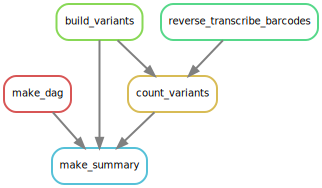

# Summary

Analysis run by [Snakefile](../../Snakefile)
using [this config file](../../config.yaml).
See the [README in the top directory](../../README.md)
for details.

Here is the DAG of the computational workflow:

Here is the Markdown output of each notebook in the workflow:

1. [Build variants from CCSs](build_variants.md).
   Creates a [codon variant table](../prior_DMS_data/codon_variant_table.csv)
   linking barcodes to the mutations in the variants.

2. [Reverse transcribe barcodes to get from R2 to R1]

3. [Count variants](count_variants.md) to create a
   [variant counts file](../counts/variant_counts.csv).