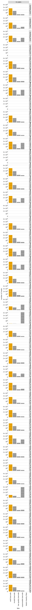

# Count variants in each sample
This Python Jupyter notebook counts occurrences of each barcode in each sample from Illumina barcode sequencing, and adds these counts to the codon variant table.

## Set up analysis
### Import Python modules.
Use [plotnine](https://plotnine.readthedocs.io/en/stable/) for ggplot2-like plotting.

The analysis relies heavily on the Bloom lab's [dms_variants](https://jbloomlab.github.io/dms_variants) package:


```python
import itertools
import multiprocessing
import multiprocessing.pool
import os
import warnings

import alignparse
import alignparse.targets

import dms_variants.codonvarianttable
from dms_variants.constants import CBPALETTE
import dms_variants.illuminabarcodeparser
import dms_variants.utils
import dms_variants.plotnine_themes

from IPython.display import display, HTML

import pandas as pd

from plotnine import *

import yaml
```

Set [plotnine](https://plotnine.readthedocs.io/en/stable/) theme to the gray-grid one defined in `dms_variants`:


```python
theme_set(dms_variants.plotnine_themes.theme_graygrid())
```

Versions of key software:


```python
print(f"Using alignparse version {alignparse.__version__}")
print(f"Using dms_variants version {dms_variants.__version__}")
```

    Using alignparse version 0.6.0
    Using dms_variants version 1.4.3


Ignore warnings that clutter output:


```python
warnings.simplefilter('ignore')
```

### Parameters for notebook
Read the configuration file:


```python
with open('config.yaml') as f:
    config = yaml.safe_load(f)
```

Make output directory if needed:


```python
os.makedirs(config['counts_dir'], exist_ok=True)
os.makedirs(config['figs_dir'], exist_ok=True)
```

## Initialize codon variant table
Initialize the [CodonVariantTable](https://jbloomlab.github.io/dms_variants/dms_variants.codonvarianttable.html#dms_variants.codonvarianttable.CodonVariantTable) using the wildtype gene sequence and the CSV file with the table of variants:


```python
# get wildtype gene sequence for primary target
targets = alignparse.targets.Targets(seqsfile=config['amplicons'],
                                     feature_parse_specs=config['feature_parse_specs'])
geneseq = targets.get_target(config['primary_target']).get_feature('gene').seq
print(f"Read gene of {len(geneseq)} nt for {config['primary_target']} from {config['amplicons']}")
      
print('Initializing CodonVariantTable from gene sequence and ' +
      config['codon_variant_table'])
      
variants = dms_variants.codonvarianttable.CodonVariantTable(
                geneseq=geneseq,
                barcode_variant_file=config['codon_variant_table'],
                substitutions_are_codon=True,
                substitutions_col='codon_substitutions',
                primary_target=config['primary_target'])
```

    Read gene of 696 nt for Fc from data/PacBio_amplicons.gb
    Initializing CodonVariantTable from gene sequence and results/prior_DMS_data/codon_variant_table.csv


## Setup to parse barcodes
Read data frame with list of all barcode runs.
Note how multiple R1 files are delimited by `; ` and are split out separately:


```python
print(f"Reading list of barcode runs from {config['rt_barcode_runs']}")

rt_barcode_runs = (pd.read_csv(config['rt_barcode_runs'])
                .assign(R1=lambda x: x['R1'].str.split('; '))
                )
      
display(HTML(rt_barcode_runs.to_html(index=False)))
```

    Reading list of barcode runs from data/rt_barcode_runs.csv


<table border="1" class="dataframe">
  <thead>
    <tr style="text-align: right;">
      <th>library</th>
      <th>sample</th>
      <th>sample_type</th>
      <th>sort_bin</th>
      <th>concentration</th>
      <th>date</th>
      <th>number_cells</th>
      <th>R1</th>
    </tr>
  </thead>
  <tbody>
    <tr>
      <td>Fc-Lib01</td>
      <td>SortSeq_bin1</td>
      <td>SortSeq</td>
      <td>1</td>
      <td>0.000000</td>
      <td>230410</td>
      <td>906600</td>
      <td>[/home/adkeith@Eu.Emory.Edu/DMS_Workflow/Fc_Data/example_titration/rt_p23096-s038_11-1_S249_L002_R2_001.fastq.gz]</td>
    </tr>
    <tr>
      <td>Fc-Lib01</td>
      <td>SortSeq_bin2</td>
      <td>SortSeq</td>
      <td>2</td>
      <td>0.000000</td>
      <td>230410</td>
      <td>25400</td>
      <td>[/home/adkeith@Eu.Emory.Edu/DMS_Workflow/Fc_Data/example_titration/rt_p23096-s039_11-2_S250_L002_R2_001.fastq.gz]</td>
    </tr>
    <tr>
      <td>Fc-Lib01</td>
      <td>SortSeq_bin3</td>
      <td>SortSeq</td>
      <td>3</td>
      <td>0.000000</td>
      <td>230410</td>
      <td>500</td>
      <td>[/home/adkeith@Eu.Emory.Edu/DMS_Workflow/Fc_Data/example_titration/rt_p23096-s040_11-3_S251_L002_R2_001.fastq.gz]</td>
    </tr>
    <tr>
      <td>Fc-Lib01</td>
      <td>SortSeq_bin4</td>
      <td>SortSeq</td>
      <td>4</td>
      <td>0.000000</td>
      <td>230410</td>
      <td>1</td>
      <td>[/home/adkeith@Eu.Emory.Edu/DMS_Workflow/Fc_Data/example_titration/rt_sparefile_conc0_bin4.fastq.gz]</td>
    </tr>
    <tr>
      <td>Fc-Lib01</td>
      <td>TiteSeq_0.002141_bin1</td>
      <td>TiteSeq</td>
      <td>1</td>
      <td>0.002141</td>
      <td>230410</td>
      <td>877400</td>
      <td>[/home/adkeith@Eu.Emory.Edu/DMS_Workflow/Fc_Data/example_titration/rt_p23096-s035_10-1_S246_L002_R2_001.fastq.gz]</td>
    </tr>
    <tr>
      <td>Fc-Lib01</td>
      <td>TiteSeq_0.002141_bin2</td>
      <td>TiteSeq</td>
      <td>2</td>
      <td>0.002141</td>
      <td>230410</td>
      <td>97700</td>
      <td>[/home/adkeith@Eu.Emory.Edu/DMS_Workflow/Fc_Data/example_titration/rt_p23096-s036_10-2_S247_L002_R2_001.fastq.gz]</td>
    </tr>
    <tr>
      <td>Fc-Lib01</td>
      <td>TiteSeq_0.002141_bin3</td>
      <td>TiteSeq</td>
      <td>3</td>
      <td>0.002141</td>
      <td>230410</td>
      <td>700</td>
      <td>[/home/adkeith@Eu.Emory.Edu/DMS_Workflow/Fc_Data/example_titration/rt_p23096-s037_10-3_S248_L002_R2_001.fastq.gz]</td>
    </tr>
    <tr>
      <td>Fc-Lib01</td>
      <td>TiteSeq_0.002141_bin4</td>
      <td>TiteSeq</td>
      <td>4</td>
      <td>0.002141</td>
      <td>230410</td>
      <td>1</td>
      <td>[/home/adkeith@Eu.Emory.Edu/DMS_Workflow/Fc_Data/example_titration/rt_sparefile_conc1_bin4.fastq.gz]</td>
    </tr>
    <tr>
      <td>Fc-Lib01</td>
      <td>TiteSeq_0.006422_bin1</td>
      <td>TiteSeq</td>
      <td>1</td>
      <td>0.006422</td>
      <td>230410</td>
      <td>771100</td>
      <td>[/home/adkeith@Eu.Emory.Edu/DMS_Workflow/Fc_Data/example_titration/rt_p23096-s032_9-1_S243_L002_R2_001.fastq.gz]</td>
    </tr>
    <tr>
      <td>Fc-Lib01</td>
      <td>TiteSeq_0.006422_bin2</td>
      <td>TiteSeq</td>
      <td>2</td>
      <td>0.006422</td>
      <td>230410</td>
      <td>206400</td>
      <td>[/home/adkeith@Eu.Emory.Edu/DMS_Workflow/Fc_Data/example_titration/rt_p23096-s033_9-2_S244_L002_R2_001.fastq.gz]</td>
    </tr>
    <tr>
      <td>Fc-Lib01</td>
      <td>TiteSeq_0.006422_bin3</td>
      <td>TiteSeq</td>
      <td>3</td>
      <td>0.006422</td>
      <td>230410</td>
      <td>900</td>
      <td>[/home/adkeith@Eu.Emory.Edu/DMS_Workflow/Fc_Data/example_titration/rt_p23096-s034_9-3_S245_L002_R2_001.fastq.gz]</td>
    </tr>
    <tr>
      <td>Fc-Lib01</td>
      <td>TiteSeq_0.006422_bin4</td>
      <td>TiteSeq</td>
      <td>4</td>
      <td>0.006422</td>
      <td>230410</td>
      <td>1</td>
      <td>[/home/adkeith@Eu.Emory.Edu/DMS_Workflow/Fc_Data/example_titration/rt_sparefile_conc2_bin4.fastq.gz]</td>
    </tr>
    <tr>
      <td>Fc-Lib01</td>
      <td>TiteSeq_0.01926_bin1</td>
      <td>TiteSeq</td>
      <td>1</td>
      <td>0.019265</td>
      <td>230410</td>
      <td>840300</td>
      <td>[/home/adkeith@Eu.Emory.Edu/DMS_Workflow/Fc_Data/example_titration/rt_p23096-s029_8-1_S240_L002_R2_001.fastq.gz]</td>
    </tr>
    <tr>
      <td>Fc-Lib01</td>
      <td>TiteSeq_0.01926_bin2</td>
      <td>TiteSeq</td>
      <td>2</td>
      <td>0.019265</td>
      <td>230410</td>
      <td>136800</td>
      <td>[/home/adkeith@Eu.Emory.Edu/DMS_Workflow/Fc_Data/example_titration/rt_p23096-s030_8-2_S241_L002_R2_001.fastq.gz]</td>
    </tr>
    <tr>
      <td>Fc-Lib01</td>
      <td>TiteSeq_0.01926_bin3</td>
      <td>TiteSeq</td>
      <td>3</td>
      <td>0.019265</td>
      <td>230410</td>
      <td>800</td>
      <td>[/home/adkeith@Eu.Emory.Edu/DMS_Workflow/Fc_Data/example_titration/rt_p23096-s031_8-3_S242_L002_R2_001.fastq.gz]</td>
    </tr>
    <tr>
      <td>Fc-Lib01</td>
      <td>TiteSeq_0.01926_bin4</td>
      <td>TiteSeq</td>
      <td>4</td>
      <td>0.019265</td>
      <td>230410</td>
      <td>1</td>
      <td>[/home/adkeith@Eu.Emory.Edu/DMS_Workflow/Fc_Data/example_titration/rt_sparefile_conc3_bin4.fastq.gz]</td>
    </tr>
    <tr>
      <td>Fc-Lib01</td>
      <td>TiteSeq_0.05779_bin1</td>
      <td>TiteSeq</td>
      <td>1</td>
      <td>0.057794</td>
      <td>230410</td>
      <td>799900</td>
      <td>[/home/adkeith@Eu.Emory.Edu/DMS_Workflow/Fc_Data/example_titration/rt_p23096-s025_7-1_S236_L002_R2_001.fastq.gz]</td>
    </tr>
    <tr>
      <td>Fc-Lib01</td>
      <td>TiteSeq_0.05779_bin2</td>
      <td>TiteSeq</td>
      <td>2</td>
      <td>0.057794</td>
      <td>230410</td>
      <td>178800</td>
      <td>[/home/adkeith@Eu.Emory.Edu/DMS_Workflow/Fc_Data/example_titration/rt_p23096-s026_7-2_S237_L002_R2_001.fastq.gz]</td>
    </tr>
    <tr>
      <td>Fc-Lib01</td>
      <td>TiteSeq_0.05779_bin3</td>
      <td>TiteSeq</td>
      <td>3</td>
      <td>0.057794</td>
      <td>230410</td>
      <td>1200</td>
      <td>[/home/adkeith@Eu.Emory.Edu/DMS_Workflow/Fc_Data/example_titration/rt_p23096-s027_7-3_S238_L002_R2_001.fastq.gz]</td>
    </tr>
    <tr>
      <td>Fc-Lib01</td>
      <td>TiteSeq_0.05779_bin4</td>
      <td>TiteSeq</td>
      <td>4</td>
      <td>0.057794</td>
      <td>230410</td>
      <td>500</td>
      <td>[/home/adkeith@Eu.Emory.Edu/DMS_Workflow/Fc_Data/example_titration/rt_p23096-s028_7-4_S239_L002_R2_001.fastq.gz]</td>
    </tr>
    <tr>
      <td>Fc-Lib01</td>
      <td>TiteSeq_0.1734_bin1</td>
      <td>TiteSeq</td>
      <td>1</td>
      <td>0.173381</td>
      <td>230410</td>
      <td>728500</td>
      <td>[/home/adkeith@Eu.Emory.Edu/DMS_Workflow/Fc_Data/example_titration/rt_p23096-s021_6-1_S232_L002_R2_001.fastq.gz]</td>
    </tr>
    <tr>
      <td>Fc-Lib01</td>
      <td>TiteSeq_0.1734_bin2</td>
      <td>TiteSeq</td>
      <td>2</td>
      <td>0.173381</td>
      <td>230410</td>
      <td>244800</td>
      <td>[/home/adkeith@Eu.Emory.Edu/DMS_Workflow/Fc_Data/example_titration/rt_p23096-s022_6-2_S233_L002_R2_001.fastq.gz]</td>
    </tr>
    <tr>
      <td>Fc-Lib01</td>
      <td>TiteSeq_0.1734_bin3</td>
      <td>TiteSeq</td>
      <td>3</td>
      <td>0.173381</td>
      <td>230410</td>
      <td>7600</td>
      <td>[/home/adkeith@Eu.Emory.Edu/DMS_Workflow/Fc_Data/example_titration/rt_p23096-s023_6-3_S234_L002_R2_001.fastq.gz]</td>
    </tr>
    <tr>
      <td>Fc-Lib01</td>
      <td>TiteSeq_0.1734_bin4</td>
      <td>TiteSeq</td>
      <td>4</td>
      <td>0.173381</td>
      <td>230410</td>
      <td>1700</td>
      <td>[/home/adkeith@Eu.Emory.Edu/DMS_Workflow/Fc_Data/example_titration/rt_p23096-s024_6-4_S235_L002_R2_001.fastq.gz]</td>
    </tr>
    <tr>
      <td>Fc-Lib01</td>
      <td>TiteSeq_0.5201_bin1</td>
      <td>TiteSeq</td>
      <td>1</td>
      <td>0.520144</td>
      <td>230410</td>
      <td>329300</td>
      <td>[/home/adkeith@Eu.Emory.Edu/DMS_Workflow/Fc_Data/example_titration/rt_p23096-s017_5-1_S228_L002_R2_001.fastq.gz]</td>
    </tr>
    <tr>
      <td>Fc-Lib01</td>
      <td>TiteSeq_0.5201_bin2</td>
      <td>TiteSeq</td>
      <td>2</td>
      <td>0.520144</td>
      <td>230410</td>
      <td>596200</td>
      <td>[/home/adkeith@Eu.Emory.Edu/DMS_Workflow/Fc_Data/example_titration/rt_p23096-s018_5-2_S229_L002_R2_001.fastq.gz]</td>
    </tr>
    <tr>
      <td>Fc-Lib01</td>
      <td>TiteSeq_0.5201_bin3</td>
      <td>TiteSeq</td>
      <td>3</td>
      <td>0.520144</td>
      <td>230410</td>
      <td>52300</td>
      <td>[/home/adkeith@Eu.Emory.Edu/DMS_Workflow/Fc_Data/example_titration/rt_p23096-s019_5-3_S230_L002_R2_001.fastq.gz]</td>
    </tr>
    <tr>
      <td>Fc-Lib01</td>
      <td>TiteSeq_0.5201_bin4</td>
      <td>TiteSeq</td>
      <td>4</td>
      <td>0.520144</td>
      <td>230410</td>
      <td>10000</td>
      <td>[/home/adkeith@Eu.Emory.Edu/DMS_Workflow/Fc_Data/example_titration/rt_p23096-s020_5-4_S231_L002_R2_001.fastq.gz]</td>
    </tr>
    <tr>
      <td>Fc-Lib01</td>
      <td>TiteSeq_01.56_bin1</td>
      <td>TiteSeq</td>
      <td>1</td>
      <td>1.560433</td>
      <td>230410</td>
      <td>48700</td>
      <td>[/home/adkeith@Eu.Emory.Edu/DMS_Workflow/Fc_Data/example_titration/rt_p23096-s013_4-1_S224_L002_R2_001.fastq.gz]</td>
    </tr>
    <tr>
      <td>Fc-Lib01</td>
      <td>TiteSeq_01.56_bin2</td>
      <td>TiteSeq</td>
      <td>2</td>
      <td>1.560433</td>
      <td>230410</td>
      <td>489600</td>
      <td>[/home/adkeith@Eu.Emory.Edu/DMS_Workflow/Fc_Data/example_titration/rt_p23096-s014_4-2_S225_L002_R2_001.fastq.gz]</td>
    </tr>
    <tr>
      <td>Fc-Lib01</td>
      <td>TiteSeq_01.56_bin3</td>
      <td>TiteSeq</td>
      <td>3</td>
      <td>1.560433</td>
      <td>230410</td>
      <td>350700</td>
      <td>[/home/adkeith@Eu.Emory.Edu/DMS_Workflow/Fc_Data/example_titration/rt_p23096-s015_4-3_S226_L002_R2_001.fastq.gz]</td>
    </tr>
    <tr>
      <td>Fc-Lib01</td>
      <td>TiteSeq_01.56_bin4</td>
      <td>TiteSeq</td>
      <td>4</td>
      <td>1.560433</td>
      <td>230410</td>
      <td>103000</td>
      <td>[/home/adkeith@Eu.Emory.Edu/DMS_Workflow/Fc_Data/example_titration/rt_p23096-s016_4-4_S227_L002_R2_001.fastq.gz]</td>
    </tr>
    <tr>
      <td>Fc-Lib01</td>
      <td>TiteSeq_04.68_bin1</td>
      <td>TiteSeq</td>
      <td>1</td>
      <td>4.681300</td>
      <td>230410</td>
      <td>2700</td>
      <td>[/home/adkeith@Eu.Emory.Edu/DMS_Workflow/Fc_Data/example_titration/rt_p23096-s009_3-1_S220_L002_R2_001.fastq.gz]</td>
    </tr>
    <tr>
      <td>Fc-Lib01</td>
      <td>TiteSeq_04.68_bin2</td>
      <td>TiteSeq</td>
      <td>2</td>
      <td>4.681300</td>
      <td>230410</td>
      <td>127600</td>
      <td>[/home/adkeith@Eu.Emory.Edu/DMS_Workflow/Fc_Data/example_titration/rt_p23096-s010_3-2_S221_L002_R2_001.fastq.gz]</td>
    </tr>
    <tr>
      <td>Fc-Lib01</td>
      <td>TiteSeq_04.68_bin3</td>
      <td>TiteSeq</td>
      <td>3</td>
      <td>4.681300</td>
      <td>230410</td>
      <td>235600</td>
      <td>[/home/adkeith@Eu.Emory.Edu/DMS_Workflow/Fc_Data/example_titration/rt_p23096-s011_3-3_S222_L002_R2_001.fastq.gz]</td>
    </tr>
    <tr>
      <td>Fc-Lib01</td>
      <td>TiteSeq_04.68_bin4</td>
      <td>TiteSeq</td>
      <td>4</td>
      <td>4.681300</td>
      <td>230410</td>
      <td>635900</td>
      <td>[/home/adkeith@Eu.Emory.Edu/DMS_Workflow/Fc_Data/example_titration/rt_p23096-s012_3-4_S223_L002_R2_001.fastq.gz]</td>
    </tr>
    <tr>
      <td>Fc-Lib01</td>
      <td>TiteSeq_14.04_bin1</td>
      <td>TiteSeq</td>
      <td>1</td>
      <td>14.043899</td>
      <td>230410</td>
      <td>700</td>
      <td>[/home/adkeith@Eu.Emory.Edu/DMS_Workflow/Fc_Data/example_titration/rt_p23096-s005_2-1_S216_L002_R2_001.fastq.gz]</td>
    </tr>
    <tr>
      <td>Fc-Lib01</td>
      <td>TiteSeq_14.04_bin2</td>
      <td>TiteSeq</td>
      <td>2</td>
      <td>14.043899</td>
      <td>230410</td>
      <td>71900</td>
      <td>[/home/adkeith@Eu.Emory.Edu/DMS_Workflow/Fc_Data/example_titration/rt_p23096-s006_2-2_S217_L002_R2_001.fastq.gz]</td>
    </tr>
    <tr>
      <td>Fc-Lib01</td>
      <td>TiteSeq_14.04_bin3</td>
      <td>TiteSeq</td>
      <td>3</td>
      <td>14.043899</td>
      <td>230410</td>
      <td>128400</td>
      <td>[/home/adkeith@Eu.Emory.Edu/DMS_Workflow/Fc_Data/example_titration/rt_p23096-s007_2-3_S218_L002_R2_001.fastq.gz]</td>
    </tr>
    <tr>
      <td>Fc-Lib01</td>
      <td>TiteSeq_14.04_bin4</td>
      <td>TiteSeq</td>
      <td>4</td>
      <td>14.043899</td>
      <td>230410</td>
      <td>798700</td>
      <td>[/home/adkeith@Eu.Emory.Edu/DMS_Workflow/Fc_Data/example_titration/rt_p23096-s008_2-4_S219_L002_R2_001.fastq.gz]</td>
    </tr>
    <tr>
      <td>Fc-Lib01</td>
      <td>TiteSeq_42.13_bin1</td>
      <td>TiteSeq</td>
      <td>1</td>
      <td>42.131696</td>
      <td>230410</td>
      <td>700</td>
      <td>[/home/adkeith@Eu.Emory.Edu/DMS_Workflow/Fc_Data/example_titration/rt_p23096-s001_1-1_S212_L002_R2_001.fastq.gz]</td>
    </tr>
    <tr>
      <td>Fc-Lib01</td>
      <td>TiteSeq_42.13_bin2</td>
      <td>TiteSeq</td>
      <td>2</td>
      <td>42.131696</td>
      <td>230410</td>
      <td>62300</td>
      <td>[/home/adkeith@Eu.Emory.Edu/DMS_Workflow/Fc_Data/example_titration/rt_p23096-s002_1-2_S213_L002_R2_001.fastq.gz]</td>
    </tr>
    <tr>
      <td>Fc-Lib01</td>
      <td>TiteSeq_42.13_bin3</td>
      <td>TiteSeq</td>
      <td>3</td>
      <td>42.131696</td>
      <td>230410</td>
      <td>82000</td>
      <td>[/home/adkeith@Eu.Emory.Edu/DMS_Workflow/Fc_Data/example_titration/rt_p23096-s003_1-3_S214_L002_R2_001.fastq.gz]</td>
    </tr>
    <tr>
      <td>Fc-Lib01</td>
      <td>TiteSeq_42.13_bin4</td>
      <td>TiteSeq</td>
      <td>4</td>
      <td>42.131696</td>
      <td>230410</td>
      <td>855400</td>
      <td>[/home/adkeith@Eu.Emory.Edu/DMS_Workflow/Fc_Data/example_titration/rt_p23096-s004_1-4_S215_L002_R2_001.fastq.gz]</td>
    </tr>
  </tbody>
</table>


Make sure library / sample combinations are unique:


```python
assert len(rt_barcode_runs) == len(rt_barcode_runs.groupby(['library', 'sample']))
```

Make sure the the libraries for which we have barcode runs are all in our variant table:


```python
unknown_libs = set(rt_barcode_runs['library']) - set(variants.libraries)
if unknown_libs:
    raise ValueError(f"Libraries with barcode runs not in variant table: {unknown_libs}")
```

The other barcode parsing params come from the config file:


```python
parser_params = config['illumina_barcode_parser_params']

display(HTML(
    pd.Series(parser_params, name='value')
    .rename_axis(index='parameter')
    .reset_index()
    .to_html(index=False)
    ))
```


<table border="1" class="dataframe">
  <thead>
    <tr style="text-align: right;">
      <th>parameter</th>
      <th>value</th>
    </tr>
  </thead>
  <tbody>
    <tr>
      <td>upstream</td>
      <td>GGAGAGGGGCGGGATCCGC</td>
    </tr>
    <tr>
      <td>downstream</td>
      <td>TTAACGTGGCTTCTTCTGCCACAGCATGATGAGAATAATAAGGGAAATGATAGTGAGTA</td>
    </tr>
    <tr>
      <td>minq</td>
      <td>20</td>
    </tr>
    <tr>
      <td>upstream_mismatch</td>
      <td>10</td>
    </tr>
    <tr>
      <td>downstream_mismatch</td>
      <td>10</td>
    </tr>
  </tbody>
</table>


The parser needs to know the set of valid barcodes, which are stored in the variant table and are different for each library.
So we create a different parser for each library using these valid barcode sets:


```python
# create dict keyed by library, value is parser for library
parsers = {lib: dms_variants.illuminabarcodeparser.IlluminaBarcodeParser(
                    valid_barcodes=variants.valid_barcodes(lib),
                    **parser_params)
           for lib in variants.libraries}

print('Number of valid barcodes searched for by each parser:')
display(HTML(
    pd.DataFrame([(lib, len(p.valid_barcodes)) for lib, p in parsers.items()],
                 columns=['library', 'number of valid barcodes'])
    .to_html(index=False)
    ))
```

    Number of valid barcodes searched for by each parser:


<table border="1" class="dataframe">
  <thead>
    <tr style="text-align: right;">
      <th>library</th>
      <th>number of valid barcodes</th>
    </tr>
  </thead>
  <tbody>
    <tr>
      <td>Fc-Lib01</td>
      <td>44919</td>
    </tr>
  </tbody>
</table>


## Parse barcodes
We now parse the barcodes.
Since this will take a while, we utilize multiple CPUs via the Python [multiprocessing](https://docs.python.org/3.6/library/multiprocessing.html) module.
First, determine how many CPUs to use.
We use the minimum of the user-specified number hardcoded below and the number actually available.
(If you are running *interactively* on the Hutch cluster, you may need to reduce the number below in order to avoid an error as there is an enforced CPU limit on the home `rhino` nodes):


```python
ncpus = min(config['max_cpus'], multiprocessing.cpu_count())
print(f"Using {ncpus} CPUs")
```

    Using 12 CPUs


Parse the barcodes in parallel via a [multiprocessing.Pool](https://docs.python.org/3.6/library/multiprocessing.html#multiprocessing.pool.Pool) using all the available CPUs to get a list of the data frames with barcode counts / fates for each sample:


```python
def process_func(parser, r1files, library, sample):
    """Convenience function to be starmapped to multiprocessing pool."""
    return parser.parse(r1files, add_cols={'library': library, 'sample': sample})

# parallel computation of list of data frames
with multiprocessing.pool.Pool(processes=ncpus) as pool:
    bclist = pool.starmap(
                process_func,
                [(parsers[run.library], run.R1, run.library, run.sample)
                  for run in rt_barcode_runs.itertuples()],
                )
```

Now concatenate the list into data frames of barcode counts and barcode fates:


```python
counts = pd.concat([samplecounts for samplecounts, _ in bclist],
                   sort=False,
                   ignore_index=True)

print('First few lines of counts data frame:')
display(HTML(counts.head().to_html(index=False)))

fates = pd.concat([samplefates for _, samplefates in bclist],
                  sort=False,
                  ignore_index=True)

print('First few lines of fates data frame:')
display(HTML(fates.head().to_html(index=False)))
```

    First few lines of counts data frame:


<table border="1" class="dataframe">
  <thead>
    <tr style="text-align: right;">
      <th>barcode</th>
      <th>count</th>
      <th>library</th>
      <th>sample</th>
    </tr>
  </thead>
  <tbody>
    <tr>
      <td>AACCTCCGACTATGC</td>
      <td>1157</td>
      <td>Fc-Lib01</td>
      <td>SortSeq_bin1</td>
    </tr>
    <tr>
      <td>AAGACAGCATCAGAC</td>
      <td>1080</td>
      <td>Fc-Lib01</td>
      <td>SortSeq_bin1</td>
    </tr>
    <tr>
      <td>TTTCATTGCCAGATG</td>
      <td>1034</td>
      <td>Fc-Lib01</td>
      <td>SortSeq_bin1</td>
    </tr>
    <tr>
      <td>TGTAGCTGGTAAACA</td>
      <td>968</td>
      <td>Fc-Lib01</td>
      <td>SortSeq_bin1</td>
    </tr>
    <tr>
      <td>GTCTGGAGATAGATA</td>
      <td>962</td>
      <td>Fc-Lib01</td>
      <td>SortSeq_bin1</td>
    </tr>
  </tbody>
</table>


    First few lines of fates data frame:


<table border="1" class="dataframe">
  <thead>
    <tr style="text-align: right;">
      <th>fate</th>
      <th>count</th>
      <th>library</th>
      <th>sample</th>
    </tr>
  </thead>
  <tbody>
    <tr>
      <td>valid barcode</td>
      <td>2527391</td>
      <td>Fc-Lib01</td>
      <td>SortSeq_bin1</td>
    </tr>
    <tr>
      <td>invalid barcode</td>
      <td>1578531</td>
      <td>Fc-Lib01</td>
      <td>SortSeq_bin1</td>
    </tr>
    <tr>
      <td>low quality barcode</td>
      <td>338935</td>
      <td>Fc-Lib01</td>
      <td>SortSeq_bin1</td>
    </tr>
    <tr>
      <td>unparseable barcode</td>
      <td>315880</td>
      <td>Fc-Lib01</td>
      <td>SortSeq_bin1</td>
    </tr>
    <tr>
      <td>failed chastity filter</td>
      <td>0</td>
      <td>Fc-Lib01</td>
      <td>SortSeq_bin1</td>
    </tr>
  </tbody>
</table>


## Examine fates of parsed barcodes
First, we'll analyze the "fates" of the parsed barcodes.
These fates represent what happened to each Illumina read we parsed:
 - Did the barcode read fail the Illumina chastity filter?
 - Was the barcode *unparseable* (i.e., the read didn't appear to be a valid barcode based on flanking regions)?
 - Was the barcode sequence too *low quality* based on the Illumina quality scores?
 - Was the barcode parseable but *invalid* (i.e., not in our list of variant-associated barcodes in the codon variant table)?
 - Was the barcode *valid*, and so will be added to variant counts.
 
First, we just write a CSV file with all the barcode fates:


```python
fatesfile = os.path.join(config['counts_dir'], 'barcode_fates.csv')
print(f"Writing barcode fates to {fatesfile}")
fates.to_csv(fatesfile, index=False)
```

    Writing barcode fates to results/counts/barcode_fates.csv


Next, we tabulate the barcode fates in wide format:


```python
display(HTML(fates
             .pivot_table(columns='fate',
                          values='count',
                          index=['library', 'sample'])
             .to_html()
             ))
```


<table border="1" class="dataframe">
  <thead>
    <tr style="text-align: right;">
      <th></th>
      <th>fate</th>
      <th>failed chastity filter</th>
      <th>invalid barcode</th>
      <th>low quality barcode</th>
      <th>unparseable barcode</th>
      <th>valid barcode</th>
    </tr>
    <tr>
      <th>library</th>
      <th>sample</th>
      <th></th>
      <th></th>
      <th></th>
      <th></th>
      <th></th>
    </tr>
  </thead>
  <tbody>
    <tr>
      <th rowspan="44" valign="top">Fc-Lib01</th>
      <th>SortSeq_bin1</th>
      <td>0</td>
      <td>1578531</td>
      <td>338935</td>
      <td>315880</td>
      <td>2527391</td>
    </tr>
    <tr>
      <th>SortSeq_bin2</th>
      <td>0</td>
      <td>1379984</td>
      <td>292056</td>
      <td>643929</td>
      <td>2252627</td>
    </tr>
    <tr>
      <th>SortSeq_bin3</th>
      <td>0</td>
      <td>1484384</td>
      <td>354936</td>
      <td>1554300</td>
      <td>2351311</td>
    </tr>
    <tr>
      <th>SortSeq_bin4</th>
      <td>0</td>
      <td>0</td>
      <td>0</td>
      <td>1</td>
      <td>0</td>
    </tr>
    <tr>
      <th>TiteSeq_0.002141_bin1</th>
      <td>0</td>
      <td>1709080</td>
      <td>398751</td>
      <td>319400</td>
      <td>2744558</td>
    </tr>
    <tr>
      <th>TiteSeq_0.002141_bin2</th>
      <td>0</td>
      <td>1795323</td>
      <td>401106</td>
      <td>413155</td>
      <td>2892731</td>
    </tr>
    <tr>
      <th>TiteSeq_0.002141_bin3</th>
      <td>0</td>
      <td>1985605</td>
      <td>428179</td>
      <td>2132932</td>
      <td>3007981</td>
    </tr>
    <tr>
      <th>TiteSeq_0.002141_bin4</th>
      <td>0</td>
      <td>0</td>
      <td>0</td>
      <td>1</td>
      <td>0</td>
    </tr>
    <tr>
      <th>TiteSeq_0.006422_bin1</th>
      <td>0</td>
      <td>1593770</td>
      <td>398956</td>
      <td>293222</td>
      <td>2521199</td>
    </tr>
    <tr>
      <th>TiteSeq_0.006422_bin2</th>
      <td>0</td>
      <td>1443636</td>
      <td>335403</td>
      <td>268795</td>
      <td>2342129</td>
    </tr>
    <tr>
      <th>TiteSeq_0.006422_bin3</th>
      <td>0</td>
      <td>1805673</td>
      <td>375801</td>
      <td>2346004</td>
      <td>2758147</td>
    </tr>
    <tr>
      <th>TiteSeq_0.006422_bin4</th>
      <td>0</td>
      <td>0</td>
      <td>0</td>
      <td>1</td>
      <td>0</td>
    </tr>
    <tr>
      <th>TiteSeq_0.01926_bin1</th>
      <td>0</td>
      <td>1798351</td>
      <td>402163</td>
      <td>321582</td>
      <td>2893949</td>
    </tr>
    <tr>
      <th>TiteSeq_0.01926_bin2</th>
      <td>0</td>
      <td>1590985</td>
      <td>356842</td>
      <td>330522</td>
      <td>2568396</td>
    </tr>
    <tr>
      <th>TiteSeq_0.01926_bin3</th>
      <td>0</td>
      <td>1614046</td>
      <td>326852</td>
      <td>1717617</td>
      <td>2533574</td>
    </tr>
    <tr>
      <th>TiteSeq_0.01926_bin4</th>
      <td>0</td>
      <td>0</td>
      <td>0</td>
      <td>1</td>
      <td>0</td>
    </tr>
    <tr>
      <th>TiteSeq_0.05779_bin1</th>
      <td>0</td>
      <td>1484449</td>
      <td>329734</td>
      <td>273914</td>
      <td>2377867</td>
    </tr>
    <tr>
      <th>TiteSeq_0.05779_bin2</th>
      <td>0</td>
      <td>1827164</td>
      <td>422930</td>
      <td>344528</td>
      <td>2956142</td>
    </tr>
    <tr>
      <th>TiteSeq_0.05779_bin3</th>
      <td>0</td>
      <td>1761960</td>
      <td>475933</td>
      <td>2252858</td>
      <td>2877816</td>
    </tr>
    <tr>
      <th>TiteSeq_0.05779_bin4</th>
      <td>0</td>
      <td>1872981</td>
      <td>428769</td>
      <td>1871573</td>
      <td>2989408</td>
    </tr>
    <tr>
      <th>TiteSeq_0.1734_bin1</th>
      <td>0</td>
      <td>1623970</td>
      <td>362486</td>
      <td>330184</td>
      <td>2602163</td>
    </tr>
    <tr>
      <th>TiteSeq_0.1734_bin2</th>
      <td>0</td>
      <td>1688273</td>
      <td>537403</td>
      <td>309108</td>
      <td>2757239</td>
    </tr>
    <tr>
      <th>TiteSeq_0.1734_bin3</th>
      <td>0</td>
      <td>921150</td>
      <td>215482</td>
      <td>2002877</td>
      <td>1337249</td>
    </tr>
    <tr>
      <th>TiteSeq_0.1734_bin4</th>
      <td>0</td>
      <td>17944</td>
      <td>3925</td>
      <td>4181808</td>
      <td>31782</td>
    </tr>
    <tr>
      <th>TiteSeq_0.5201_bin1</th>
      <td>0</td>
      <td>1439827</td>
      <td>320910</td>
      <td>261733</td>
      <td>2219129</td>
    </tr>
    <tr>
      <th>TiteSeq_0.5201_bin2</th>
      <td>0</td>
      <td>1555419</td>
      <td>356898</td>
      <td>289885</td>
      <td>2528505</td>
    </tr>
    <tr>
      <th>TiteSeq_0.5201_bin3</th>
      <td>0</td>
      <td>1609895</td>
      <td>365451</td>
      <td>402148</td>
      <td>2605240</td>
    </tr>
    <tr>
      <th>TiteSeq_0.5201_bin4</th>
      <td>0</td>
      <td>1357093</td>
      <td>312582</td>
      <td>1253330</td>
      <td>2108396</td>
    </tr>
    <tr>
      <th>TiteSeq_01.56_bin1</th>
      <td>0</td>
      <td>1976383</td>
      <td>385409</td>
      <td>583611</td>
      <td>2792212</td>
    </tr>
    <tr>
      <th>TiteSeq_01.56_bin2</th>
      <td>0</td>
      <td>1586698</td>
      <td>363222</td>
      <td>301013</td>
      <td>2526414</td>
    </tr>
    <tr>
      <th>TiteSeq_01.56_bin3</th>
      <td>0</td>
      <td>1580237</td>
      <td>344357</td>
      <td>271890</td>
      <td>2599144</td>
    </tr>
    <tr>
      <th>TiteSeq_01.56_bin4</th>
      <td>0</td>
      <td>1659925</td>
      <td>406529</td>
      <td>311767</td>
      <td>2662838</td>
    </tr>
    <tr>
      <th>TiteSeq_04.68_bin1</th>
      <td>0</td>
      <td>2056857</td>
      <td>435910</td>
      <td>1673017</td>
      <td>3237495</td>
    </tr>
    <tr>
      <th>TiteSeq_04.68_bin2</th>
      <td>0</td>
      <td>1591629</td>
      <td>360258</td>
      <td>355327</td>
      <td>2228441</td>
    </tr>
    <tr>
      <th>TiteSeq_04.68_bin3</th>
      <td>0</td>
      <td>1466221</td>
      <td>346911</td>
      <td>277985</td>
      <td>2355653</td>
    </tr>
    <tr>
      <th>TiteSeq_04.68_bin4</th>
      <td>0</td>
      <td>1482018</td>
      <td>357339</td>
      <td>258331</td>
      <td>2425589</td>
    </tr>
    <tr>
      <th>TiteSeq_14.04_bin1</th>
      <td>0</td>
      <td>621082</td>
      <td>149185</td>
      <td>3872949</td>
      <td>968750</td>
    </tr>
    <tr>
      <th>TiteSeq_14.04_bin2</th>
      <td>0</td>
      <td>1724745</td>
      <td>355419</td>
      <td>432910</td>
      <td>2360885</td>
    </tr>
    <tr>
      <th>TiteSeq_14.04_bin3</th>
      <td>0</td>
      <td>1861585</td>
      <td>379128</td>
      <td>405855</td>
      <td>2841497</td>
    </tr>
    <tr>
      <th>TiteSeq_14.04_bin4</th>
      <td>0</td>
      <td>1719528</td>
      <td>370997</td>
      <td>307701</td>
      <td>2800756</td>
    </tr>
    <tr>
      <th>TiteSeq_42.13_bin1</th>
      <td>0</td>
      <td>1215037</td>
      <td>271563</td>
      <td>1987301</td>
      <td>1921191</td>
    </tr>
    <tr>
      <th>TiteSeq_42.13_bin2</th>
      <td>0</td>
      <td>1654026</td>
      <td>314179</td>
      <td>451476</td>
      <td>2204110</td>
    </tr>
    <tr>
      <th>TiteSeq_42.13_bin3</th>
      <td>0</td>
      <td>1606519</td>
      <td>395943</td>
      <td>402489</td>
      <td>2458272</td>
    </tr>
    <tr>
      <th>TiteSeq_42.13_bin4</th>
      <td>0</td>
      <td>1497248</td>
      <td>394924</td>
      <td>284004</td>
      <td>2449240</td>
    </tr>
  </tbody>
</table>


Now we plot the barcode-read fates for each library / sample, showing the bars for valid barcodes in orange and the others in gray.
We see that the largest fraction of barcode reads correspond to valid barcodes, and most of the others are invalid barcodes (probably because the map to variants that aren't present in our variant table since we didn't associate all variants with barcodes). The exception to this is lib2 Titeseq_03_bin3; the PCR for this sample in the original sequencing run failed, so we followed it up with a single MiSeq lane. We did not filter out the PhiX reads from this data before parsing, so these PhiX reads will deflate the fraction of valid barcode reads as expected, but does not indicate any problems.


```python
barcode_fate_plot = (
    ggplot(
        fates
        .assign(sample=lambda x: pd.Categorical(x['sample'],
                                                x['sample'].unique(),
                                                ordered=True),
                fate=lambda x: pd.Categorical(x['fate'],
                                              x['fate'].unique(),
                                              ordered=True),
                is_valid=lambda x: x['fate'] == 'valid barcode'
                ), 
        aes('fate', 'count', fill='is_valid')) +
    geom_bar(stat='identity') +
    facet_grid('sample ~ library') +
    facet_grid('sample ~ library') +
    scale_fill_manual(CBPALETTE, guide=False) +
    theme(figure_size=(1.4 * (1 + fates['library'].nunique()),
                       1.7 * (1.2 + fates['sample'].nunique())),
          axis_text_x=element_text(angle=90),
          panel_grid_major_x=element_blank()
          ) +
    scale_y_continuous(labels=dms_variants.utils.latex_sci_not,
                       name='number of reads')
    )

_ = barcode_fate_plot.draw()
```


    

    


## Add barcode counts to variant table
Now we use the [CodonVariantTable.add_sample_counts_df](https://jbloomlab.github.io/dms_variants/dms_variants.codonvarianttable.html#dms_variants.codonvarianttable.CodonVariantTable.add_sample_counts_df) method to add the barcode counts to the variant table:


```python
variants.add_sample_counts_df(counts)
```

The variant table now has a `variant_count_df` attribute that gives a data frame of all the variant counts.
Here are the first few lines:


```python
display(HTML(variants.variant_count_df.head().to_html(index=False)))
```


<table border="1" class="dataframe">
  <thead>
    <tr style="text-align: right;">
      <th>target</th>
      <th>library</th>
      <th>sample</th>
      <th>barcode</th>
      <th>count</th>
      <th>variant_call_support</th>
      <th>codon_substitutions</th>
      <th>aa_substitutions</th>
      <th>n_codon_substitutions</th>
      <th>n_aa_substitutions</th>
    </tr>
  </thead>
  <tbody>
    <tr>
      <td>Fc</td>
      <td>Fc-Lib01</td>
      <td>SortSeq_bin1</td>
      <td>AACCTCCGACTATGC</td>
      <td>1157</td>
      <td>2</td>
      <td>TTG143GTG</td>
      <td>L143V</td>
      <td>1</td>
      <td>1</td>
    </tr>
    <tr>
      <td>Fc</td>
      <td>Fc-Lib01</td>
      <td>SortSeq_bin1</td>
      <td>AAGACAGCATCAGAC</td>
      <td>1080</td>
      <td>2</td>
      <td></td>
      <td></td>
      <td>0</td>
      <td>0</td>
    </tr>
    <tr>
      <td>Fc</td>
      <td>Fc-Lib01</td>
      <td>SortSeq_bin1</td>
      <td>TTTCATTGCCAGATG</td>
      <td>1034</td>
      <td>1</td>
      <td>GTG47ATC</td>
      <td>V47I</td>
      <td>1</td>
      <td>1</td>
    </tr>
    <tr>
      <td>Fc</td>
      <td>Fc-Lib01</td>
      <td>SortSeq_bin1</td>
      <td>TGTAGCTGGTAAACA</td>
      <td>968</td>
      <td>2</td>
      <td>CGG40TTC</td>
      <td>R40F</td>
      <td>1</td>
      <td>1</td>
    </tr>
    <tr>
      <td>Fc</td>
      <td>Fc-Lib01</td>
      <td>SortSeq_bin1</td>
      <td>GTCTGGAGATAGATA</td>
      <td>962</td>
      <td>2</td>
      <td></td>
      <td></td>
      <td>0</td>
      <td>0</td>
    </tr>
  </tbody>
</table>


Confirm that we have counts for all of our library / sample combinations:


```python
pd.testing.assert_frame_equal(
    rt_barcode_runs[['library', 'sample']]
                .sort_values(['library', 'sample'])
                .reset_index(drop=True),
    variants.variant_count_df
        [['library', 'sample']]
        .drop_duplicates()
        .sort_values(['library', 'sample'])
        .reset_index(drop=True),
    check_dtype=False,
    check_categorical=False,
    check_like=True,
    )
```


```python
rt_barcode_runs[['library', 'sample']].sort_values(['library', 'sample'])
```


<div>
<style scoped>
    .dataframe tbody tr th:only-of-type {
        vertical-align: middle;
    }

    .dataframe tbody tr th {
        vertical-align: top;
    }

    .dataframe thead th {
        text-align: right;
    }
</style>
<table border="1" class="dataframe">
  <thead>
    <tr style="text-align: right;">
      <th></th>
      <th>library</th>
      <th>sample</th>
    </tr>
  </thead>
  <tbody>
    <tr>
      <th>0</th>
      <td>Fc-Lib01</td>
      <td>SortSeq_bin1</td>
    </tr>
    <tr>
      <th>1</th>
      <td>Fc-Lib01</td>
      <td>SortSeq_bin2</td>
    </tr>
    <tr>
      <th>2</th>
      <td>Fc-Lib01</td>
      <td>SortSeq_bin3</td>
    </tr>
    <tr>
      <th>3</th>
      <td>Fc-Lib01</td>
      <td>SortSeq_bin4</td>
    </tr>
    <tr>
      <th>4</th>
      <td>Fc-Lib01</td>
      <td>TiteSeq_0.002141_bin1</td>
    </tr>
    <tr>
      <th>5</th>
      <td>Fc-Lib01</td>
      <td>TiteSeq_0.002141_bin2</td>
    </tr>
    <tr>
      <th>6</th>
      <td>Fc-Lib01</td>
      <td>TiteSeq_0.002141_bin3</td>
    </tr>
    <tr>
      <th>7</th>
      <td>Fc-Lib01</td>
      <td>TiteSeq_0.002141_bin4</td>
    </tr>
    <tr>
      <th>8</th>
      <td>Fc-Lib01</td>
      <td>TiteSeq_0.006422_bin1</td>
    </tr>
    <tr>
      <th>9</th>
      <td>Fc-Lib01</td>
      <td>TiteSeq_0.006422_bin2</td>
    </tr>
    <tr>
      <th>10</th>
      <td>Fc-Lib01</td>
      <td>TiteSeq_0.006422_bin3</td>
    </tr>
    <tr>
      <th>11</th>
      <td>Fc-Lib01</td>
      <td>TiteSeq_0.006422_bin4</td>
    </tr>
    <tr>
      <th>12</th>
      <td>Fc-Lib01</td>
      <td>TiteSeq_0.01926_bin1</td>
    </tr>
    <tr>
      <th>13</th>
      <td>Fc-Lib01</td>
      <td>TiteSeq_0.01926_bin2</td>
    </tr>
    <tr>
      <th>14</th>
      <td>Fc-Lib01</td>
      <td>TiteSeq_0.01926_bin3</td>
    </tr>
    <tr>
      <th>15</th>
      <td>Fc-Lib01</td>
      <td>TiteSeq_0.01926_bin4</td>
    </tr>
    <tr>
      <th>16</th>
      <td>Fc-Lib01</td>
      <td>TiteSeq_0.05779_bin1</td>
    </tr>
    <tr>
      <th>17</th>
      <td>Fc-Lib01</td>
      <td>TiteSeq_0.05779_bin2</td>
    </tr>
    <tr>
      <th>18</th>
      <td>Fc-Lib01</td>
      <td>TiteSeq_0.05779_bin3</td>
    </tr>
    <tr>
      <th>19</th>
      <td>Fc-Lib01</td>
      <td>TiteSeq_0.05779_bin4</td>
    </tr>
    <tr>
      <th>20</th>
      <td>Fc-Lib01</td>
      <td>TiteSeq_0.1734_bin1</td>
    </tr>
    <tr>
      <th>21</th>
      <td>Fc-Lib01</td>
      <td>TiteSeq_0.1734_bin2</td>
    </tr>
    <tr>
      <th>22</th>
      <td>Fc-Lib01</td>
      <td>TiteSeq_0.1734_bin3</td>
    </tr>
    <tr>
      <th>23</th>
      <td>Fc-Lib01</td>
      <td>TiteSeq_0.1734_bin4</td>
    </tr>
    <tr>
      <th>24</th>
      <td>Fc-Lib01</td>
      <td>TiteSeq_0.5201_bin1</td>
    </tr>
    <tr>
      <th>25</th>
      <td>Fc-Lib01</td>
      <td>TiteSeq_0.5201_bin2</td>
    </tr>
    <tr>
      <th>26</th>
      <td>Fc-Lib01</td>
      <td>TiteSeq_0.5201_bin3</td>
    </tr>
    <tr>
      <th>27</th>
      <td>Fc-Lib01</td>
      <td>TiteSeq_0.5201_bin4</td>
    </tr>
    <tr>
      <th>28</th>
      <td>Fc-Lib01</td>
      <td>TiteSeq_01.56_bin1</td>
    </tr>
    <tr>
      <th>29</th>
      <td>Fc-Lib01</td>
      <td>TiteSeq_01.56_bin2</td>
    </tr>
    <tr>
      <th>30</th>
      <td>Fc-Lib01</td>
      <td>TiteSeq_01.56_bin3</td>
    </tr>
    <tr>
      <th>31</th>
      <td>Fc-Lib01</td>
      <td>TiteSeq_01.56_bin4</td>
    </tr>
    <tr>
      <th>32</th>
      <td>Fc-Lib01</td>
      <td>TiteSeq_04.68_bin1</td>
    </tr>
    <tr>
      <th>33</th>
      <td>Fc-Lib01</td>
      <td>TiteSeq_04.68_bin2</td>
    </tr>
    <tr>
      <th>34</th>
      <td>Fc-Lib01</td>
      <td>TiteSeq_04.68_bin3</td>
    </tr>
    <tr>
      <th>35</th>
      <td>Fc-Lib01</td>
      <td>TiteSeq_04.68_bin4</td>
    </tr>
    <tr>
      <th>36</th>
      <td>Fc-Lib01</td>
      <td>TiteSeq_14.04_bin1</td>
    </tr>
    <tr>
      <th>37</th>
      <td>Fc-Lib01</td>
      <td>TiteSeq_14.04_bin2</td>
    </tr>
    <tr>
      <th>38</th>
      <td>Fc-Lib01</td>
      <td>TiteSeq_14.04_bin3</td>
    </tr>
    <tr>
      <th>39</th>
      <td>Fc-Lib01</td>
      <td>TiteSeq_14.04_bin4</td>
    </tr>
    <tr>
      <th>40</th>
      <td>Fc-Lib01</td>
      <td>TiteSeq_42.13_bin1</td>
    </tr>
    <tr>
      <th>41</th>
      <td>Fc-Lib01</td>
      <td>TiteSeq_42.13_bin2</td>
    </tr>
    <tr>
      <th>42</th>
      <td>Fc-Lib01</td>
      <td>TiteSeq_42.13_bin3</td>
    </tr>
    <tr>
      <th>43</th>
      <td>Fc-Lib01</td>
      <td>TiteSeq_42.13_bin4</td>
    </tr>
  </tbody>
</table>
</div>


```python
((variants.variant_count_df
        [['library', 'sample']]
        .drop_duplicates()
        .sort_values(['library', 'sample'])
        .reset_index(drop=True)) == rt_barcode_runs[['library', 'sample']].sort_values(['library', 'sample']).reset_index(drop=True)).query('sample == False')
```


<div>
<style scoped>
    .dataframe tbody tr th:only-of-type {
        vertical-align: middle;
    }

    .dataframe tbody tr th {
        vertical-align: top;
    }

    .dataframe thead th {
        text-align: right;
    }
</style>
<table border="1" class="dataframe">
  <thead>
    <tr style="text-align: right;">
      <th></th>
      <th>library</th>
      <th>sample</th>
    </tr>
  </thead>
  <tbody>
  </tbody>
</table>
</div>


Write the variant counts data frame to a CSV file.
It can then be used to re-initialize a [CodonVariantTable](https://jbloomlab.github.io/dms_variants/dms_variants.codonvarianttable.html#dms_variants.codonvarianttable.CodonVariantTable) via its [from_variant_count_df](https://jbloomlab.github.io/dms_variants/dms_variants.codonvarianttable.html#dms_variants.codonvarianttable.CodonVariantTable.from_variant_count_df) method:


```python
print(f"Writing variant counts to {config['variant_counts']}")
variants.variant_count_df.to_csv(config['variant_counts'], index=False)
```

    Writing variant counts to results/counts/variant_counts.csv


The [CodonVariantTable](https://jbloomlab.github.io/dms_variants/dms_variants.codonvarianttable.html#dms_variants.codonvarianttable.CodonVariantTable) has lots of nice functions that can be used to analyze the counts it contains.
However, we do that in the next notebook so we don't have to re-run this entire (rather computationally intensive) notebook every time we want to analyze a new aspect of the counts.


```python

```


```python

```
